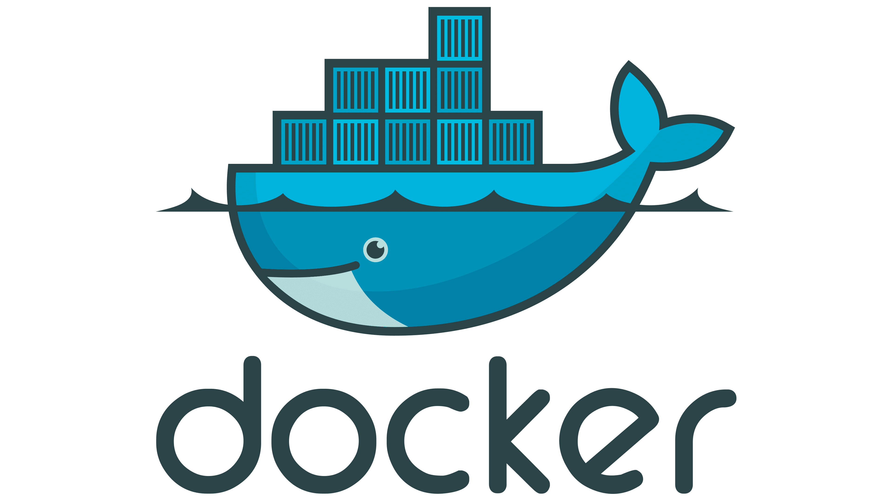
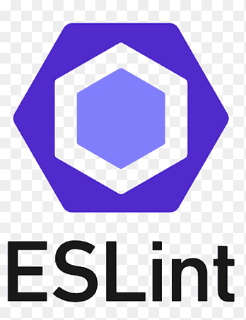
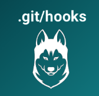
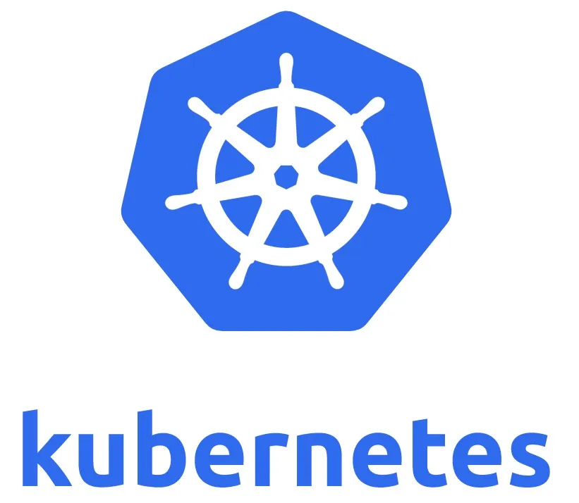
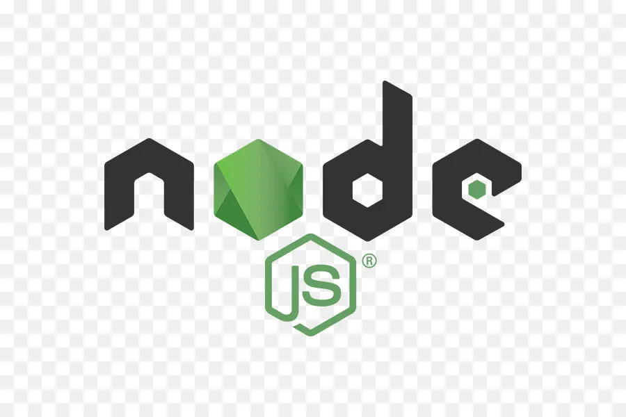
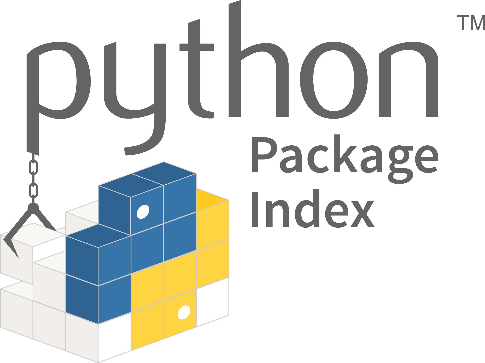
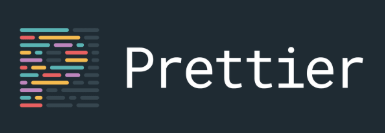

# npm-web-sampler

[`CODE_OF_CONDUCT`](./CODE_OF_CONDUCT.md) | [`CONTRIBUTING`](./CONTRIBUTING.md) | [`LICENSE`](./LICENSE.md) | [`SECURITY`](./SECURITY.md) | [`CHANGELOG`](./CHANGELOG.md) | [`TODO`s](./TODO.md)

- [](https://github.com/percebus/npm-web-sampler/actions/workflows/always.yml)
- [](https://github.com/percebus/npm-web-sampler/actions/workflows/mega-linter.yml)
- [](https://github.com/percebus/npm-web-sampler/actions/workflows/pull_request.yml)
- [](https://github.com/percebus/npm-web-sampler/actions/workflows/dependabot/dependabot-updates)

## Summary

A web sampler of technologies and tools that can be used to quickly scaffold a web-project

- `npm`
- `bower`
- `pip` ( & `pipx`)
- `grunt`
- `jasmine`: `jest`, `testem` & `frisby`
- `semantic-release`: To automagically create releases
- `docker` ( & `docker-compose` )
- `helm`: To Deploy to Kubernetes
- `megalinter`
- `parcel`: Bundler

## Motivation

This project goes to great lengths to prove all the DevOps & CI/CD work needed for something like simple static `index.html`.

This is ALL THE BELLS AND WHISTLES, but WITHOUT the Christmas tree 🎄.

## Purpose

Demonstrate the amount of code and overhead needed for devops, even without having an actual project.

## Package Managers

| name    | file                                               | lock file                                              | destination                   | comments                          |
| ------- | -------------------------------------------------- | ------------------------------------------------------ | ----------------------------- | --------------------------------- |
| `npm`   | [`package.json`](./package.json)                   | [`package-lock.json`](./package-lock.json)             | `node_packages/`              | Node packages                     |
| `bower` | [`bower.json`](./bower.json)                       |                                                        | [`repositories/`](./.bowerrc) | `git clone {repo}@main`           |
| `pip`   | [`requirements*.txt`](./requirements.txt)          | [`requirements.frozen.txt`](./requirements.frozen.txt) | `.venv/`                      | `pip install -r requirements.txt` |
| `pipx`  | [`requirements.pipx.txt`](./requirements.pipx.txt) |                                                        | `.venv/`                      | `pip` executable-only packages    |

<!-- prettier-ignore-start -->
> [!WARNING]
> `bower` is `DEPRECATED`. We only use the task runner. But NOT the `bower` registry.

> [!NOTE]
> `gil` (`pip install`) could replace `bower` for `git clone {repo}@main` functionality.
> I wish `npm` would allow this.
<!-- prettier-ignore-end -->

## Task Runners

| name      | file                             | comments             |
| --------- | -------------------------------- | -------------------- |
| `npm/npx` | [`package.json`](./package.json) | See `scripts`        |
| `yarn`    | [`package.json`](./package.json) | See `scripts:yarn:*` |
| `grunt`   | [`Gruntfile.js`](./Gruntfile.js) | For advanced tasks   |

## Linting

| tool          | file                                                           |
| ------------- | -------------------------------------------------------------- |
| `prettier`    | [`.prettierrc*`](./.prettierrc.js)                             |
| `htmllint`    | [`.htmllintrc`](./.htmllintrc) [(via `grunt`)](./Gruntfile.js) |
| `lint-staged` | [`.lintstagedrc.json`](./.lintstagedrc.json)                   |
| `standardx`   | [`.eslintrc*`](./.eslintrc)                                    |

### MegaLinter

| file                                         | does                                                                    |
| -------------------------------------------- | ----------------------------------------------------------------------- |
| [`.mega-linter.yml`](./.mega-linter.yml)     | MegaLinter: All-in-one linter                                           |
| [`.cspell.json`](./.cspell.json)             | Code Spell Checker                                                      |
| [`.djlintrc`](./.djlintrc)                   | DjLint: HTML, Markdown and YAML linter and formatter                    |
| [`.markdownlint.json`](./.markdownlint.json) | MarkdownLint: Markdown style checker                                    |
| [`.htmlnanorc`](./.htmlnanorc)               | HTMLHint: Static code analysis tool you can use to check your HTML code |
| [`.jscpd.json`](./.jscpd.json)               | JSCPD: Copy/Paste Detector                                              |
| [`.lycheeignore`](./.lycheeignore)           | Lychee: Link checker                                                    |
| [`.posthtmlrc`](./.posthtmlrc)               | PostHTML: Tool to transform HTML/XML with JS plugins                    |

## Testing

### [B]ehavior [D]riven [D]evelopment

- [`features/`](./features/)
- [`testem.yml`](./testem.yml): Test'em (run unit tests in all browsers)
- [`__tests__/`](./__tests__/)
  - `*.unit.spec.js`: `jest`+`jasmine` unit tests
  - `*.rest.spec.js`: `jest`+`jasmine`+`frisby` RESTful Integration tests
  - `*.se.spec.js`: `jest`+`selenium` Integration tests: (See below)
  - `*.pw.spec.js`: `jest`+`playwright` Integration tests

### Selenium

- [`selenium/`](./selenium/)
- [`__tests__/`](./__tests__/)
  - `*.se.spec.js`: Integration tests
  - `*.se.js`: Manual tests

## Setup

### env

#### `.env` files

1. Copy `.env.*.local.example` to `.env.*.local` and modify as needed. i.e.-
   1. `.env.development.local.example`

#### `env/` folder

Convenient `scripts` to `export FOO` into memory,

1. Copy `.*.src.sh.example` to `.*.src.sh` and modify as needed. i.e.-
   1. `google.src.src.sh.example`: For `npx gemini` CLI
   2. `kaggle.src.sh.example`: For `kaggle` CLI

### Husky

**Install**:

```bash
$> npm run husky:install
```

See [`.husky/`](./.husky/)

**Uninstall**:

```bash
$> npm run husky:uninstall
```

### Dependencies

1. `$> npm run setup`
1. `$> npm install`

## Development

[](https://github.com/percebus/npm-web-sampler/actions/workflows/always.yml)

### Build

#### `dist/`

```bash
$> npm run dist
```

### Test

#### Unit

```bash
$> npm test
```

#### Browsers

```bash
$> npm run testem:ci
```

#### Integration

```bash
$> npm run validate
```

### Verify

Build + Test

```bash
$> npm run verify
```

#### w/ Docker

```bash
$> npm run verify:docker
```

## References

 <!-- markdown-link-check-disable -->

- [Playwright vs Selenium: What are the Main Differences and Which is Better?](https://applitools.com/blog/playwright-vs-selenium/)

### Medium

- [Container Security: A Complete Overview of GitHub Actions Integrated Image Scanning Tools](https://medium.com/@anshumaansingh10jan/container-security-a-complete-overview-of-github-actions-integrated-image-scanning-tools-832e6406ec23)
- [Using dotenv with Jest](https://lusbuab.medium.com/using-dotenv-with-jest-7e735b34e55f)
- [Deploy Your Programs onto Minikube with Docker and Helm](https://siweheee.medium.com/deploy-your-programs-onto-minikube-with-docker-and-helm-a68097e8d545)
- [Docker + Kubernetes + Helm: A comprehensive step-by-step using Java](https://ignaciocicero.medium.com/docker-kubernetes-helm-a-comprehensive-step-by-step-using-java-df83f6780d80)
- [Setting up ESlint with Standard and Prettier](https://medium.com/nerd-for-tech/setting-up-eslint-with-standard-and-prettier-be245cb9fc64)
- [Jest + Selenium WebDriver](https://medium.com/@mathieux51/jest-selenium-webdriver-e25604969c6)

### Container-ization

- [How to Use Your Own Registry](https://www.docker.com/blog/how-to-use-your-own-registry-2/)
- [Deploying a Docker Container to Kubernetes using Helm and Helm Charts](https://aahil13.hashnode.dev/deploying-a-docker-container-to-kubernetes-using-helm-and-helm-charts)

<!-- markdown-link-check-enable -->

### GitHub

- [`percebus`](https://github.com/percebus) /
  - [`commons`](https://github.com/percebus/commons)
  - [`percebus-assets`](https://github.com/percebus/percebus-assets)

## Logos

<table>
  <tbody>
    <tr>
      <td></td>
      <td align="center">
        <br />
        BrowserBase.com
      </td>
      <td></td>
      <td></td>
    </tr>
    <tr>
      <td></td>
      <td></td>
      <td></td>
      <td></td>
    </tr>
    <tr>
      <td></td>
      <td></td>
      <td></td>
      <td></td>
    </tr>
    <tr>
    </tr>
    <tr>
      <td></td>
      <td></td>
      <td></td>
      <td></td>
    </tr>
    <tr>
      <td></td>
      <td></td>
      <td></td>
      <td></td>
    </tr>
    <tr>
      <td></td>
      <td></td>
      <td></td>
      <td align="center">
        <br />
        <code>semantic-release</code>
      </td>
    </tr>
    <tr>
    </tr>
    <tr>
      <td></td>
  </tbody>
</table>
