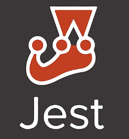

# npm-web-sampler

[`CHANGELOG`](./CHANGELOG.md) | [`TODO`s](./TODO.md) | [`LICENSE`](./LICENSE.md) | [`CONTRIBUTING`](./CONTRIBUTING.md) | [`CODE_OF_CONDUCT`](./CODE_OF_CONDUCT.md) | [`SECURITY`](./SECURITY.md)

[](https://github.com/percebus/npm-web-sampler/actions/workflows/always.yml) [](https://github.com/percebus/npm-web-sampler/actions/workflows/pull_request.yml) [](https://github.com/percebus/npm-web-sampler/actions/workflows/dependabot/dependabot-updates)

## Summary

A web sampler of technologies and tools that can be used to quickly scaffold a web-project

- `npm`
- `bower`
- `pip` ( & `pipx`)
- `grunt`
- `jasmine`: `jest`, `testem` & `frisby`
- `semantic-release`: To automagically create releases
- `docker` ( & `docker-compose` )
- `helm`: To Deploy to Kubernetes

## Motivation

This project goes to great lengths to prove all the DevOps & CI/CD work needed for something like simple static `index.html`.

This is ALL THE BELLS AND WHISTLES, but WITHOUT the Christmas tree 🎄.

## Purpose

Demonstrate the amount of code and overhead needed for devops, even without having an actual project.

## Setup

### First time

```bash
$> npm run setup
```

### Dependencies

```bash
$> npm install
```

## Development

[](https://github.com/percebus/npm-web-sampler/actions/workflows/always.yml)

### Build

#### `dist/`

```bash
$> npm run dist
```

### Test

#### Unit

```bash
$> npm test
```

#### Browsers

```bash
$> npm run testem:ci
```

#### Integration

```bash
$> npm run validate
```

### Verify

Build + Test

```bash
$> npm run verify
```

#### w/ Docker

```bash
$> npm run verify:docker
```

## Resources

- [Playwright vs Selenium: What are the Main Differences and Which is Better?](https://applitools.com/blog/playwright-vs-selenium/)

### Medium

- [Container Security: A Complete Overview of GitHub Actions Integrated Image Scanning Tools](https://medium.com/@anshumaansingh10jan/container-security-a-complete-overview-of-github-actions-integrated-image-scanning-tools-832e6406ec23)
- [Using dotenv with Jest](https://lusbuab.medium.com/using-dotenv-with-jest-7e735b34e55f)
- [Deploy Your Programs onto Minikube with Docker and Helm](https://siweheee.medium.com/deploy-your-programs-onto-minikube-with-docker-and-helm-a68097e8d545)
- [Docker + Kubernetes + Helm: A comprehensive step-by-step using Java](https://ignaciocicero.medium.com/docker-kubernetes-helm-a-comprehensive-step-by-step-using-java-df83f6780d80)
- [Setting up ESlint with Standard and Prettier](https://medium.com/nerd-for-tech/setting-up-eslint-with-standard-and-prettier-be245cb9fc64)
- [Jest + Selenium WebDriver](https://medium.com/@mathieux51/jest-selenium-webdriver-e25604969c6)

### Container-ization

- [How to Use Your Own Registry](https://www.docker.com/blog/how-to-use-your-own-registry-2/)
- [Deploying a Docker Container to Kubernetes using Helm and Helm Charts](https://aahil13.hashnode.dev/deploying-a-docker-container-to-kubernetes-using-helm-and-helm-charts)

## Logos

<table>
  <tbody>
    <tr>
      <td></td>
      <td></td>
      <td></td>
    </tr>
    <tr>
      <td></td>
      <td></td>
      <td></td>
    </tr>
    <tr>
      <td></td>
      <td></td>
      <td></td>
    </tr>
    <tr>
      <td></td>
      <td></td>
      <td></td>
    </tr>
    <tr>
      <td></td>
      <td></td>
      <td></td>
    </tr>
    <tr>
      <td></td>
      <td></td>
      <td></td>
    </tr>
    <tr>
      <td></td>
      <td></td>
      <td></td>
    </tr>
  </tbody>
</table>
